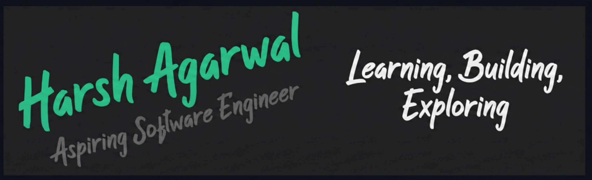

# Hello, folks! 

My name is **Harsh Agarwal**.  
I enjoy learning how software systems work, building things step by step, and improving through problem-solving.

You can find me on GitHub or LinkedIn.

---

## 🔧 Technologies & Tools

### 🧑‍💻 Programming

### 🛠 Tools & OS

### 📚 Libraries & Frameworks

### 🌐 Web & Databases

---

## 📈 GitHub Stats

---

### 🔗 Links
- GitHub: https://github.com/hrshagarwal  
- LinkedIn: https://www.linkedin.com/in/harshagarwal22/

  

